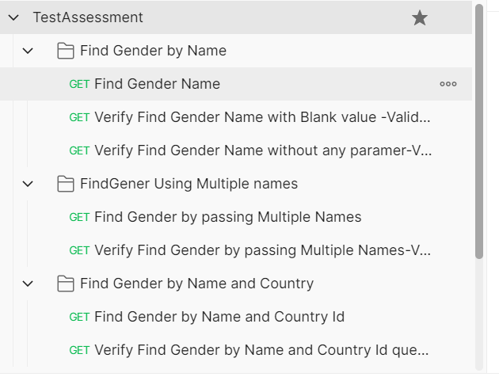

# To Design and develop test cases for validating functionality of a set of APIs, listed below, using Postman

<b>Test Instructions</b>

## csv
Files for use in the Postman Collection Runner
- **TestData.csv**:

<b>Run locally using Postman</b>
1. Download the collection and the environment file to your local drive. Save them in the same folder.
2. Open Postman App on your desktop
3. Import the collection
4. Select the data file "TestData.csv" to run the tests 
5. Then run the test using the collection runner, by selecting the "TestAssessment.postman_environment" environment.

<b>Run locally using CLI</b>
1. Download the collection and the environment file to your local drive. Save them in the same folder.
2. Make sure you have 'newman' and it's pre-requisite installed. Link: https://www.npmjs.com/package/newman, also download and install "npm install -g newman-reporter-htmlextra"
3. Open command prompt, go to the location where you downloaded the collection on step 1. Eg: "cd C:\users\username\documents\pmGenderAssessment\tests"
4. Enter this line: newman run ./tests/TestAssessment.postman_collection.json -e ./tests/TestAssessment.postman_environment.json -d "./TestData.csv" --reporters cli,htmlextra --reporter-htmlextra-export testReport.html 

#Test Scripts Folder Structure

#Test Report 

 
#Interactive report :
Download and open this url 
https://github.com/banumanj/pmGenderAssessment/blob/main/testReport.html

#Test Execution recoding video :
This video includes test with less itteration on passing data file with only 4 Names 
Download and open the video links   
https://github.com/banumanj/pmGenderAssessment/blob/main/Test%20results%20fom%20command%20line%20.webm
https://github.com/banumanj/pmGenderAssessment/blob/main/Postman%20UI%20%20test-recording.webm
